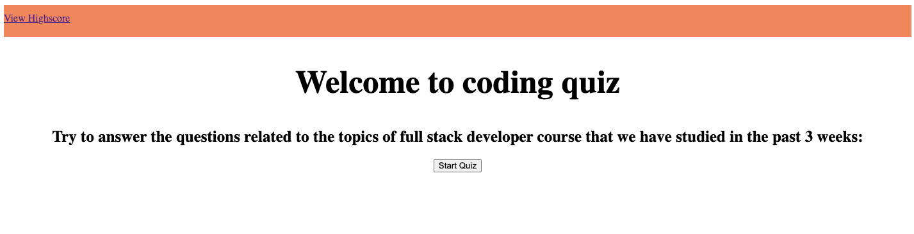
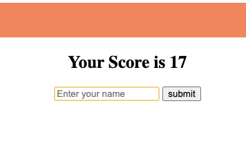
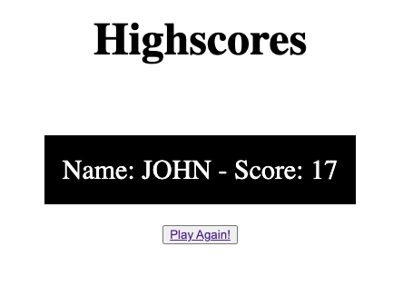

# Multiple Choice Questions Science Trivia

## Description

This application would mainly focus on developing the logic by using Javascript in creating a quiz format and dynamic application for user interaction. Developing an interactive multiple questions website helps widening the reach of education to the wider market and internationally.

In creating this application, I learn how complex the logic of JS can be and how much you can do with it.

## Installation

- First I git cloned the repo into my computer
- Develop the basic format of HTML with different divs
- Then create a basic CSS to visualize a clear separation between the different sections
- Write the JS code to start manipulating the HTML by hiding and unhiding sections
- Create the questions as an array with objects
- Create a logic in adding the questions into the HTML as part of an element
- Create a logic in answering and checking whether the answer is correct or not.
- Set a timer function to end game once timer ends
- Create a logic in saving highscore and bringing the webpage to the highscore page once game ends

## Usage

Github page: https://mecuboi.github.io/bootcamp-quiz/

Press the start button to start the game

Then select the answer that you think is correct by clicking on it. If you get the wrong answer, then the timer will deduct your time by 15 seconds.

Enter your name so that we have a record of your score

Your score will be the time you have left at the end of the game.

## Credits

- W3schools.com
- developer.mozilla.org
- bootcamp topics

## License

